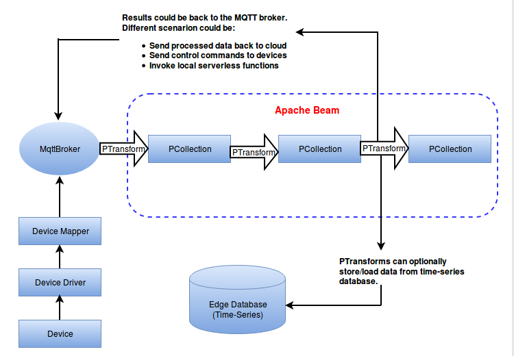
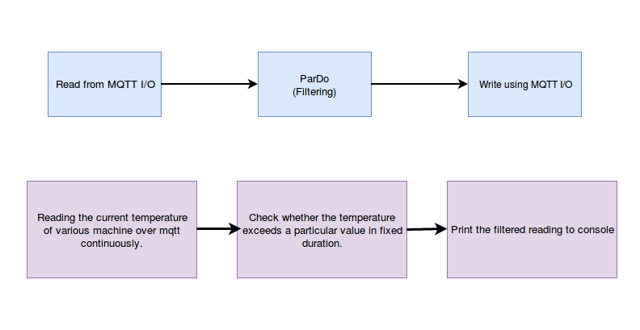

# Data Analytics @ Edge

## Description



The main aim of analytics engine is to get data from mqtt broker in stream format and apply rules on incoming data in real time and produce alert/action on mqtt broker. Getting data through pipeline and applying analysis function is done by using Apache Beam.

###  Apache beam:
Apache Beam is an open source, unified model for defining both batch and streaming data-parallel processing pipelines. Using one of the open source Beam SDKs, we can build a program that defines the pipeline.


#### Why use Apache Beam for analytics:
There are many frameworks like Hadoop, Spark, Flink, Google Cloud Dataflow etc for stream processing. But there was no unified API to binds all such frameworks and data sources. It was needed to abstract out the application logic from these Big Data frameworks. Apache Beam framework provides this abstraction between your application logic and big data ecosystem. 
- A generic dataflow-based model for building an abstract pipeline which could be run on any runtime like Flink/Samza etc.
- The same pipeline code can be executed on cloud(eg. Huawei Cloud Stream based on Apache Flink) and on the edge with a custom backend which can efficiently schedule workloads in an edge cluster and perform distributed analytics.
- Apache Beam integrates well with TensorFlow for machine learning which is a key use-case for edge.
- Beam has support for most of the functions required for stream processing and analytics.

#### Demo 1.1 [Real-time alert]:Read batch data from MQTT,filter and generate alerts
- Basic mqtt read/write support in Apache Beam for batch data
- Reads data from an mqtt topic
- Create PCollection of read data and use it as the initial data for pipeline
- Do a filtering over the data
- Publish an alert on a topic if reading exceeds the value


#### Demo 1.2 [Filter Streaming Data]: Reads streaming data from MQTT, filter at regular intervals
- Read streaming data using MQTT
- Do a filtering over the data at fixed time intervals


### Prerequisites
- Golang(version: 1.11.4)
- KubeEdge(version: v0.1)
- Docker(version: 18.06.1-ce)

### Deploy pipeline application:
For demo 1.1:
Pull the docker image from dockerhub by using following command
```shell
   $ sudo docker pull containerise/ke_apache_beam:ke_apache_analysis_v1.1
```
For demo 1.2:
Pull the docker image from dockerhub by using following command
```shell
   $ sudo docker pull containerise/ke_apache_beam:ke_apache_analysis_v1.2
```
Run the command
```shell
   $ docker images
```
This will shows all images created. Check image named ke_apache_analysis_v1.1 or ke_apache_analysis_v1.2

Follows steps from [here](https://github.com/kubeedge/kubeedge/blob/master/README.md) to setup prerequisite environment.
	
Try out a application deployment by following below steps.
```shell
   $ kubectl apply -f examples/KE-Apache-Beam-Analysis/KE-Apache-Beam-Deployment.yaml
```
Then you can use below command to check if the application is normally running.
```shell
kubectl get pods
```

To check result, publish dummy data by using [testmachine](MQTT_Publisher/testmachine.go). 

Add following vendor packages:
```shell
   $ go get -u github.com/yosssi/gmq/mqtt
   $ go get -u github.com/yosssi/gmq/mqtt/client
```
run:
```shell
   $ go build testmachine.go
   $ ./testmachine
```
    


