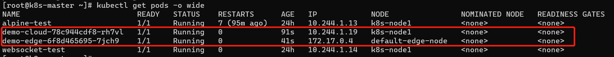

# Pod_communication_in_HTTP_through_EdgeMesh

## Description

- cloud pod can get random number created by edge pod through communicating in HTTP

## Environment prepare

- KubeEdge,k8s ,node,cloud and so on 
- In cloud and edge, you should prepare for go version = 1.17
- In cloud and edge, you should ensure edgemesh can run effectively

## Deployment application

1. Create image and upload it to the corresponding device

2. prepare for cloud_Pod and edge_Pod

   ```sh
   kubectl apply -f demo_edge.yaml
   kubectl apply -f demo_cloud.yaml
   ```

3. check pod

   

4. check service

   

5. access cloud pod 

   

6. check logs

   