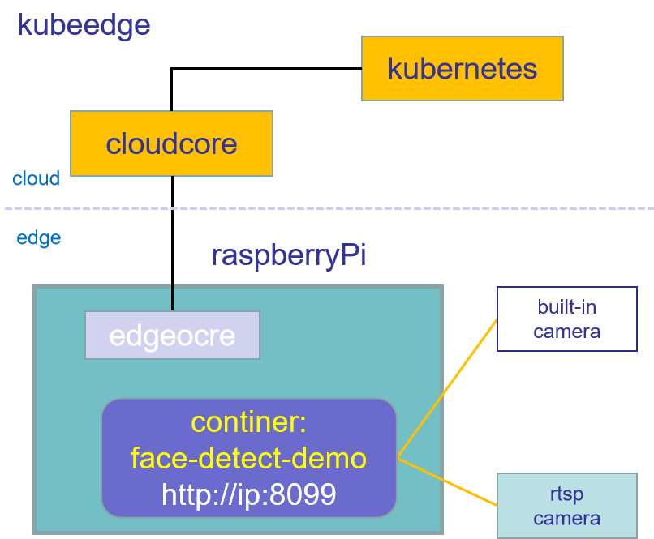

# face detect example
* This demonstration is based on kubeedge, allowing part of the algorithm analysis ability to run on the edge. 
* Demo is just an example, you can use this as an example to run various algorithm applications on the edge. 
* The docker image used in this example can be used as a [basic image](./dockerfile/Dockerfile) to make images of different business scenarios.
* The demo does not necessarily have better performance, this is just a scenario demonstration. 

## Details for the face detect demo, please read the [Demo guide](./guides/face_detect_demo_guide.md)