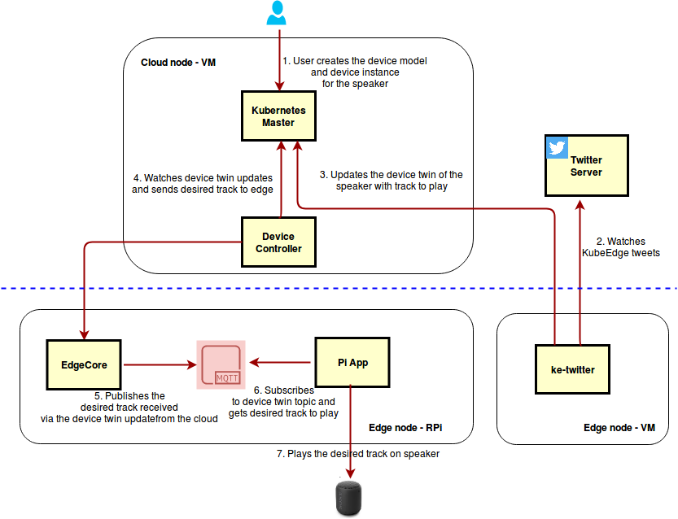

# KubeEdge Twitter Demo
A user tweets `kubeedge play <track>` to play the track. The tweet metadata is pushed to the edge node and the track is played on the speaker connected to the edge node.



## Prerequisites

### Hardware Prerequisites
- RaspBerry-Pi (RaspBerry-Pi 3 has been used for this demo). This will be the edge node to which the speaker will be connected.
- A speaker for playing the track.

### Software Prerequisites
- A running Kubernetes cluster.
- KubeEdge [0.3.0-beta.0](https://github.com/kubeedge/kubeedge/releases/tag/v0.3.0-beta.0)
  See [instructions](https://github.com/kubeedge/kubeedge/blob/master/docs/getting-started/usage.md#run-kubeedge) on how to setup 
  KubeEdge.
- In order to control the speaker and play the desired track , we need to manage the speaker connected to the rpi.
  KubeEdge allows us to manage devices using K8S custom resource definitions. The design proposal is [here](https://github.com/kubeedge/kubeedge/blob/master/docs/proposals/device-crd.md). Apply the CRD schema yamls available [here](https://github.com/kubeedge/kubeedge/tree/master/build/crds/devices) using kubectl. 

## Steps to run the demo
### Get demo code
Clone the demo github [repo](https://github.com/rohitsardesai83/ke-twitter-demo)

### Create the device model and device instance for the speaker
With the Device CRD APIs now installed in the cluster , we now create the device model and instance for the speaker using the yaml files
[here](https://github.com/rohitsardesai83/ke-twitter-demo/tree/master/examples/crds)

### Create Secret for Twitter Credentials
- The cloud app in the demo needs to watch KubeEdge tweets. For this the application needs to sign the requests with a Twitter account.
Follow the steps mentioned here [Guide for reference](https://docs.inboundnow.com/guide/create-twitter-application/) to generate the OAuth credentials. Create a Kubernetes [Secret](https://github.com/rohitsardesai83/ke-twitter-demo) `twittersecret` with the credentials as below : 

```sh
kubectl create secret generic twittersecret --from-literal=CONSUMER_KEY=<your_consumer_key> --from-literal=CONSUMER_SECRET=<your_consumer_secret> --from-literal=ACCESS_TOKEN=<your_access_token> --from-literal=ACCESS_TOKEN_SECRET=<your_access_token_secret>
```

### Run the ke-tweeeter app
- The ke-tweeter-app runs in a VM on the cloud and watches for KubeTweets. It can deployed using a Kubernetes deployment yaml
```sh
$ cd $GOPATH/github.com/ke-twitter-demo/ke-tweeter/deployments/
$ kubectl create -f ke-tweeter.yaml
```
### Build the track player app
- Cross-complie the PiApp which will run on the RPi and play the desired track.
```sh
~/go/src/github.com/ke-twitter-demo$export GOARCH=arm
~/go/src/github.com/ke-twitter-demo$export GOOS="linux"
~/go/src/github.com/ke-twitter-demo$export GOARM=6                             #Pls give the appropriate arm version of your device  
~/go/src/github.com/ke-twitter-demo$export CGO_ENABLED=1
~/go/src/github.com/ke-twitter-demo$export CC=arm-linux-gnueabi-gcc
~/go/src/github.com/ke-twitter-demo$ go build Pi_app/trackplayer.go
```
### Run the track player app
- Copy the trackplayer binary to the rpi. Make sure the MQTT broker is running on the rpi.
  Run the binary. The app will subscibe to the `$hw/events/device/speaker-01/twin/update/document` topic 
  and when it receives the desired track on the topic, it will play it on the speaker.

```sh
$ ./trackplayer
```

### Tweet to play track
- Login to twitter and tweet the track name you wish to play. Please tweet in the following format : 
```sh
kubeedge play <track>
```
The track info is pushed to the rpi and the track is played on the speaker.
