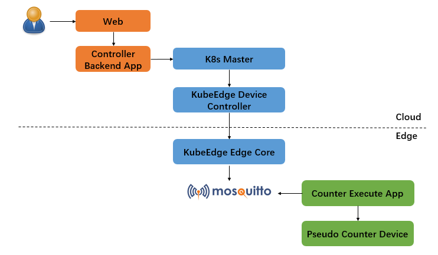
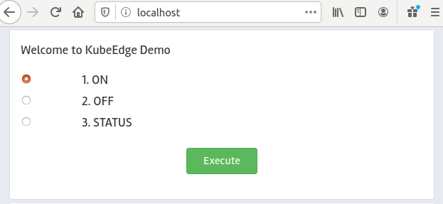

# KubeEdge Counter Demo

## Description

Counter is a pseudo device that user can run this demo without any extra physical devices.

Counter run at edge side, and user can control it in web from cloud side, also can get counter value in web from cloud side.




## Prerequisites

### Hardware Prerequisites

* RaspBerry PI (RaspBerry PI 4 has been used for this demo).

### Software Prerequisites

* A running Kubernetes cluster.

  *NOTE*:

  add follows `--insecure-port=8080` and `--insecure-bind-address=0.0.0.0` options into */etc/kubernetes/manifests/kube-apiserver.yaml*

* KubeEdge [1.2.1](https://github.com/kubeedge/kubeedge/tree/v1.2.1)  
  See [instructions](http://docs.kubeedge.io/en/latest/index.html) on how to setup KubeEdge.

* MQTT Broker is running on Raspi.

## Steps to run the demo

### Create the device model and device instance for the counter

With the Device CRD APIs now installed in the cluster, we create the device model and instance for the counter using the yaml files.

```console
 cd $GOPATH/src/github.com/kubeedge/examples/kubeedge-counter-demo/crds
 kubectl create -f kubeedge-counter-model.yaml
 kubectl create -f kubeedge-counter-instance.yaml
```

*NOTE*:
in *crds/kubeedge-counter-instance.yaml*, make sure *nodeSelector* value match with correct edge node name.

### Run KubeEdge Web App

The KubeEdge Web App runs in a VM on cloud.

```console
 cd $GOPATH/src/github.com/kubeedge/examples/kubeedge-counter-demo/crds
 kubectl create -f kubeedge-web-controller-app.yaml
```

### Run KubeEdge Pi Counter App

The KubeEdge Counter App run in raspi.

```console
 cd $GOPATH/src/github.com/kubeedge/examples/kubeedge-counter-demo/crds
 kubectl create -f kubeedge-pi-counter-app.yaml
```

The App will subscribe to the `$hw/events/device/counter/twin/update/document` topic, and when it receives the expected control command on the topic, it will turn on/off the counter, also it will fresh counter value and publish value to `$hw/events/device/counter/twin/update` topic, then the latest counter status will be sychronized between edge and cloud.

At last, user can get the counter status at cloud side.


### Control counter by visiting Web App Page

* Visit web app page by the web app link `MASTER_NODE_IP:80`.

  

* Choose `ON` option, and click `Execute`, then user can see counter start to count by `docker logs -f counter-container-id` at edge side.

* Choose `STATUS` option, then click `Execute` to get the counter status, finally counter status and current counter value will display in web.

  also you can watch counter status by `kubectl get device counter -o yaml -w` at cloud side.

* Choose `OFF` option, and click `Execute`, counter stop work at edge side.
