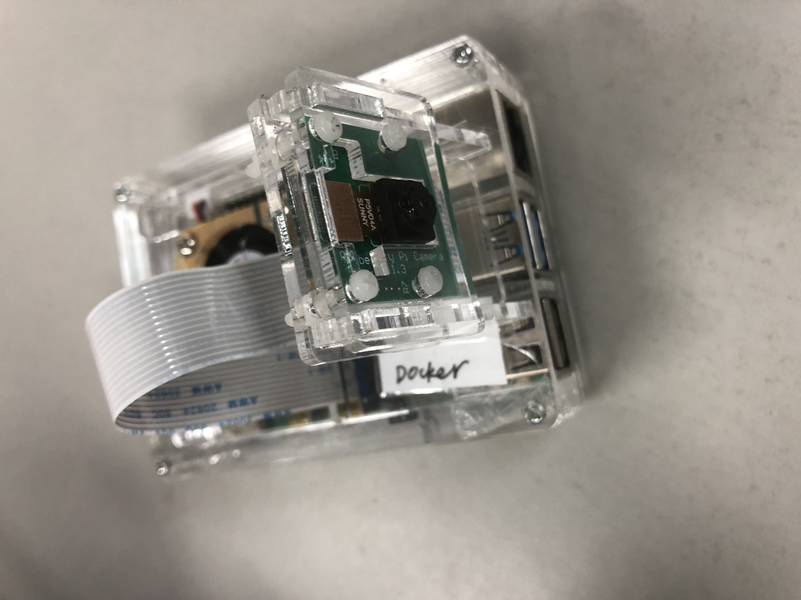
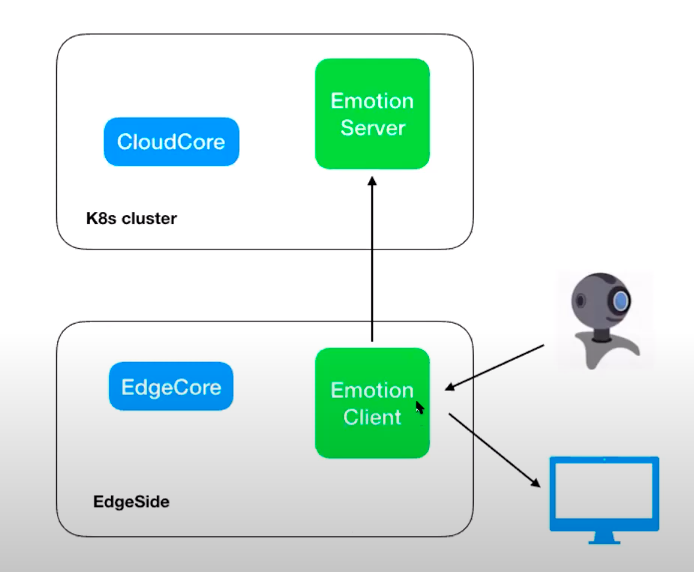

# KubeEdge Emotion Recognition Demo

## Description

KubeEdge Emotion Recognition is demo of emotion recognition with raspberry Pi. Raspberry Pi is equipped with an RS/E4 standard camera.



## Deployment Diagram 



## Prerequisites

### Hardware Prerequisites

1. RaspBerry-Pi (RaspBerry-Pi 4 has been used for this demo)
2. RS/E4 Camera
3. Display

## Steps to reproduce

1. Clone the kubeedge/examples repository.

```console
git clone https://github.com/kubeedge/examples.git /root/examples
```

2. Deploy Emotion Recognition Server.

```console
kubectl apply -f  /root/examples/kubeedge-emotion-recognition-demo/emotion-server.yaml
```

3. Deploy Emotion Recognition Client To raspberry Pi.

```console
kubectl apply -f  /root/examples/kubeedge-emotion-recognition-demo/emotion-client.yaml
```
```
    spec:
      containers:
      - env:
        - name: DISPLAY
          value: :0
        - name: FACEEMOTION_SERVER
          value: $EMOTION_SERVER    #set emotion server address 
        - name: FACEEMOTION_PORT
          value: $EMOTION_CLIENT    #set emotion server port
        volumeMounts:
        - mountPath: /tmp/.X11-unix 
          name: x11
        - mountPath: /dev/video0
          name: video
        securityContext:
          privileged: true
      volumes:
      - name: x11
        hostPath:
          path: /tmp/.X11-unix     #match your display device
      - name: video
        hostPath:
          path: /dev/video0        #match your camera device
```

**Note:**  Only when a face is detected , the expression will appear on the display. 
