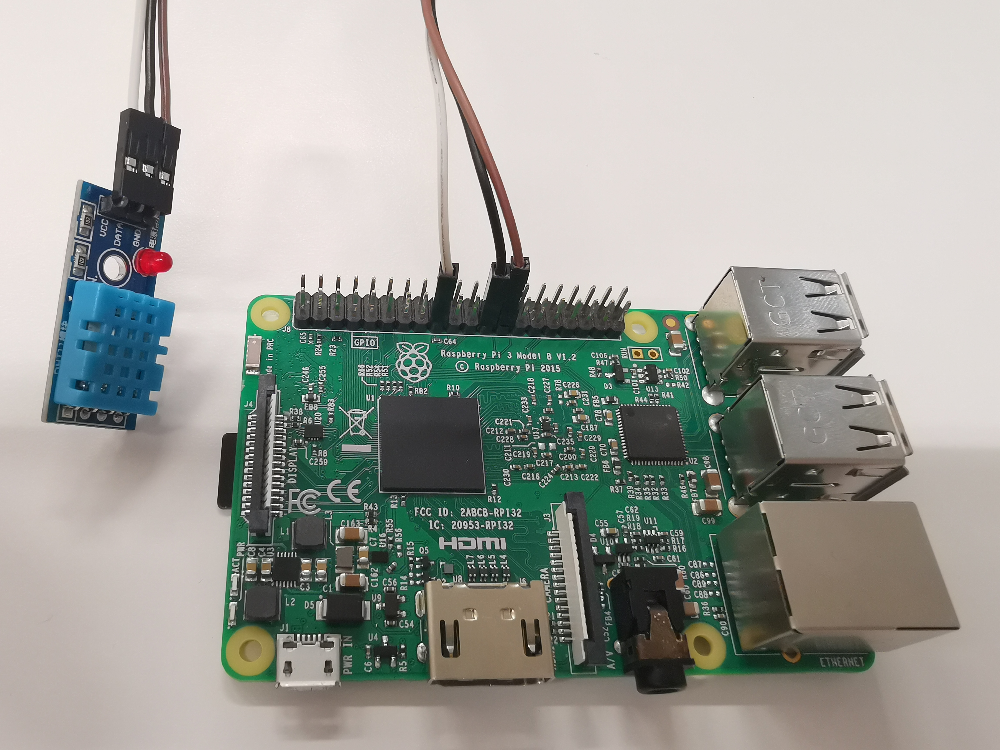

# Temperature Mapper
 
 
 ## Description
 
Temperature Mapper contains code to collect temperature from a temperature sensor which connected to a raspberry Pi through gpio.


  
The following diagram has been followed to make the connection with the 
temperature sensor in this case :-


Depending on the expected state of the temperature sensor, the program collect the temperature.


## Prerequisites 

### Hardware Prerequisites

1. RaspBerry-Pi (RaspBerry-Pi 3/4 has been used for this demo)
2. GPIO 
3. Temperature sensor (DHT11)

### Software Prerequisites
 
1. Golang (Version 1.12 has been used for this demo)
2. KubeEdge (Version 1.1 has been used for this demo)

## Steps to reproduce

1. Connect the temperature sensor to the RaspBerry-Pi using the GPIO as shown in the [circuit diagram](images/temperature-sensor-wiring.PNG) above.   

2. Clone and run KubeEdge. 

3. Clone the kubeedge/examples repository.

```console
git clone https://github.com/kubeedge/examples.git $GOPATH/src/github.com/kubeedge/examples
```

4. Create the temperature device model and device instance.

```console
cd $GOPATH/src/github.com/kubeedge/examples/kubeedge-temperature-demo/crds
kubectl apply -f devicemodel.yaml
kubectl apply -f device.yaml

# Note: Update the nodename to your own edge node name in device.yaml.
```
 
 6. Build the mapper to run in RaspBerry-Pi.

```shell         
cd $GOPATH/src/github.com/kubeedge/examples/kubeedge-temperature-demo
docker build -t <your_dockerhub_username>/kubeedge-temperature-mapper:<your_tag> .
docker push <your_dockerhub_username>/kubeedge-temperature-mapper:<your_tag>

# Note: Before trying to push the docker image to the remote repository please ensure that you have signed into docker from your node, if not please type the followig command to sign in
```
 
 7. Deploy the temperature mapper.
        
```console
cd $GOPATH/src/github.com/kubeedge/examples/kubeedge-temperature-demo/

# Please enter the following details in the deployment.yaml :-
#    1. Replace <edge_node_name> with the name of your edge node at spec.template.spec.nodeSelector.name
#    2. Replace <your_image> at spec.template.spec.containers.image

kubectl create -f deployment.yaml
```
 
  8. The mapper will report back the temperature to cloud after updating. Observe the temperature in the cloud side.
  
```shell         
kubectl get device temperature -oyaml -w
```

 
