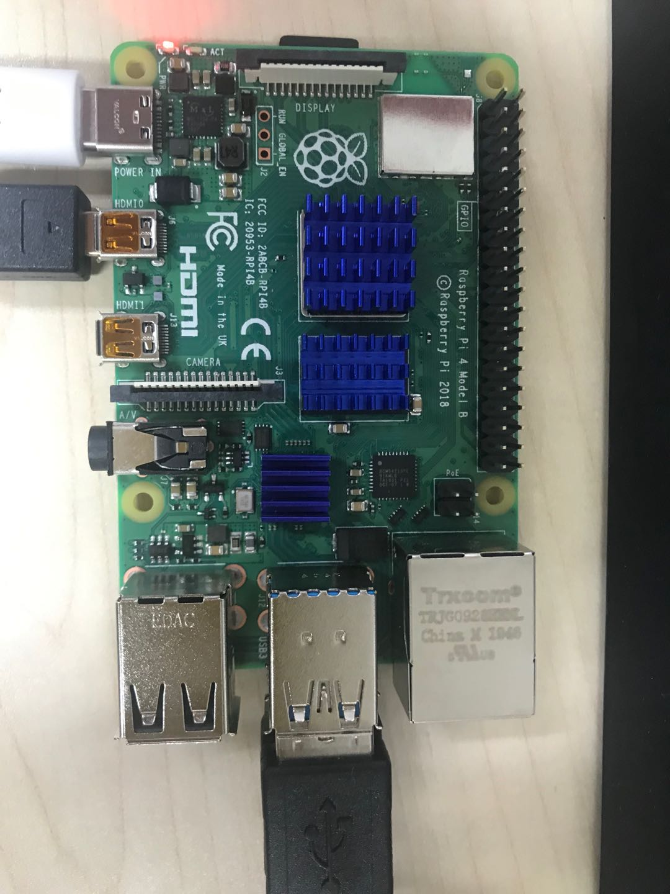

# kubeedge ai demo
## Description
This demo contains two general modeule:AI algorithm moudel and zigbee device moudle.
## Prerequisites  
### Hardware Prerequisites  
1. CC2531 USB sniffer with firmware has been refreshe

2. Xiao Mi zigbee power plug ZNCZ02LM
  
3. Raspberry pi 4b 
 
### Software Prerequisites  
1. KubeEdge (v1.4.0)  
## Steps to reproduce
1. Clone the project 
2. Run KubEdge
### AI algorithm moudel
#### Face recognition    
``` $ cd face-recong  
    $ docekr build -t face-recon:dev  
    $ cd ..
    $ kubectl apply -f faceReconDeplloyment.yaml
 ```  
1. Calling the camera defaults to a local camera, and you can change the address of the IP Camera by using -- camera = ip:port   
2. You can add the --show parameter to determine whether the recognition results are displayed on the display.  
3. When adding the --show parameter, you can pass in face data via the S key on the keyboard  
4. Copy the model to the local /model/facenet directory before running it
#### Moving object detection  
``` $ cd motion detection  
    $ docekr build -t motion-detection:dev 
    $ cd ..
    $ kubectl apply -f motionDetectionDeployment.yaml
 ```    
1. The camera information configuration is the same as face recognition
2. When a moving object appears in front of the camera, the program will record the video and save the result to the local directory /data/video
### Device moudle
#### Device&DeviceModel
``` $ cd crds
    $ kubectl apply -f devicemodel.yaml
    $ kubectl apply -f device.yaml
 ```    
When the device is connected, you can view the results of cloud device synchronization through the following command
``` $ kubectl get device switch -oyaml -w
```   
#### zigbee2mqtt  
``` $ cd zigbee2mqtt
    $ docker build -t zigbee2mqtt:v1 .
    $ cd ..
    $ kubeclt apply -f deployzigbee2mqtt.yaml
```
1. Make sure cc2531 USB Sniffer is connected to your device and there is a directory /dev/ttyacm0
#### mapper
``` $ cd mapper
    $ docker build -t mapper:v1 .
    $ kubeclt apply -f deployMapper.yaml  
```  
During face recognition, the ZigBee switch will be turned on if the recognition result exists in the face database.If the result is unknown, the Zigbee switch will be turned off.The status information of the switch can be viewed through Device Switch in the cloud.

