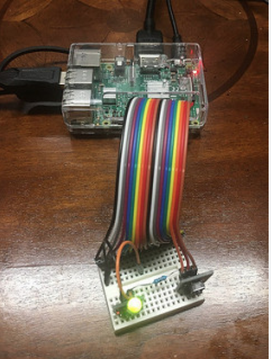
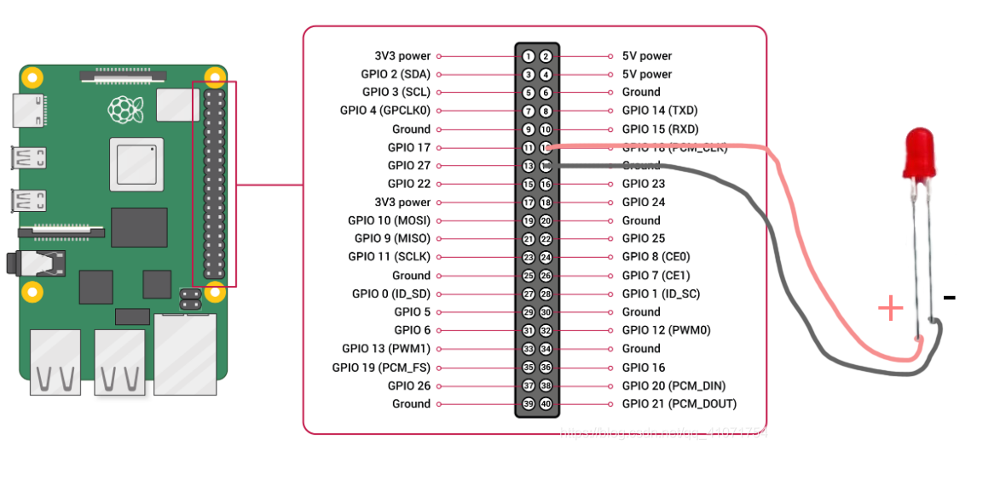

# Light Mapper
 
 
 ## Description
 
Light Mapper contains code to control an LED light connected to a raspberry Pi through gpio.


  
The following diagram has been followed to make the connection with the 
LED in this case :-



Here we are using a push button  switch to test the working condition of the LED, through an independent  circuit.

Depending on the expected state of the light, the program controls whether or not to provide power in pin-18 of the gpio.
When power is provided in the pin, the LED glows (ON State) and when no power is provided on it then it does not glow (OFF state).


## Prerequisites 

### Hardware Prerequisites

1. RaspBerry-Pi (RaspBerry-Pi 3 has been used for this demo)
2. GPIO
3. Breadboard along with wires 
4. LED light
5. Push Button switch (to test the working condition of the light, this can be skipped if needed)

### Software Prerequisites
 
1. Golang (Version 1.11.4 has been used for this demo)
2. KubeEdge (Version 0.3 has been used for this demo)

## Steps to reproduce

1. Connect the LED to the RaspBerry-Pi using the GPIO as shown in the [circuit diagram](images/raspberry-pi-wiring.png) above.   

2. Clone and run KubeEdge. 
    Please click [KubeEdge Usage](https://github.com/kubeedge/kubeedge/blob/master/docs/getting-started/usage.md) for instructions on the usage of KubeEdge.

3. Clone the led_raspberrypi_demo

       ```shell
                   git clone https://github.com/kubeedge/examples.git $GOPATH/src/github.com/kubeedge/examples
        ```

4. Create the LED device in the cloud, by creating device model and device instance CRDs

       ```shell
                   cd $GOPATH/src/github.com/kubeedge/examples/led-raspberrypi/sample-crds
                   kubectl apply -f led-light-device-model.yaml
                   kubectl apply -f led-light-device-instance.yaml

                   Note: You can change the CRDs to match your requirement
        ```

 5. Update the name of the device (device instance name) created using the device CRD in the previous step along with the MQTT mode using which edge_core is running in the configuration file present at $GOPATH/src/github.com/kubeedge/examples/led-raspberrypi/configuration/config.yaml
 
 6. Build the mapper to run in RaspBerry-Pi.

    ```shell         
                cd $GOPATH/src/github.com/kubeedge/examples/led-raspberrypi/
                make # or `make led_light_mapper`
                docker tag led-light-mapper:v1.1 <your_dockerhub_username>/led-light-mapper:v1.1
                docker push <your_dockerhub_username>/led-light-mapper:v1.1

                Note: Before trying to push the docker image to the remote repository please ensure that you have signed into docker from your node, if not please type the followig command to sign in
                 docker login
                 # Please enter your username and password when prompted

    ```
 
 7. Deploy the light mapper.
        
    ```shell
                cd $GOPATH/src/github.com/kubeedge/examples/led-raspberrypi/

                # Please enter the following details in the deployment.yaml :-
                #    1. Replace <edge_node_name> with the name of your edge node at spec.template.spec.voluems.configMap.name
                #    2. Replace <your_dockerhub_username> with your dockerhub username at spec.template.spec.containers.image

                kubectl create -f deployment.yaml
     ```
 
  8. Change the device Twin attribute (expected value) "power-state" of the device to "ON" to turn on the light, and
 "OFF" to turn off the light using the device CRDs. The mapper will control the LED to match the state mentioned in the cloud and also report back
 the actual state of the light to the cloud after updating.

 
