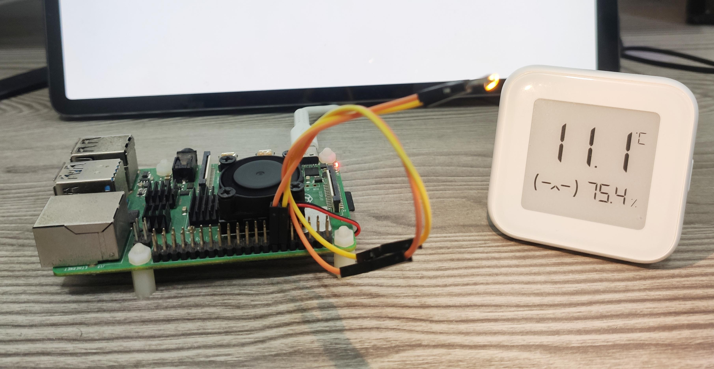
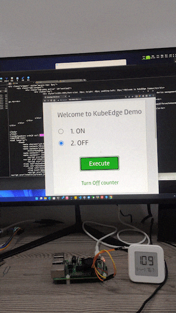

# Light Mapper


 ## Description

Light Mapper contains code to control an LED light connected to a raspberry Pi through gpio.



The following diagram has been followed to make the connection with the
LED in this case :-


Important: For safety, please use a protection resistor in this circuit.

Depending on the expected state of the light, the program controls whether or not to provide power in pin-18 of the gpio.
When power is provided in the pin, the LED glows (ON State) and when no power is provided on it then it does not glow (OFF state).


## Prerequisites

### Hardware Prerequisites

1. RaspBerry-Pi (RaspBerry-Pi 3 has been used for this demo)
2. GPIO
3. Breadboard along with wires
4. LED light


### Software Prerequisites

1. Golang 1.14+
2. KubeEdge 1.5+

## Steps to reproduce

1. Connect the LED to the RaspBerry-Pi using the GPIO as shown in the [circuit diagram](images/raspberry-pi-wiring.png) above.

2. Clone and run KubeEdge.
    Please ensure that the kubeedge setup is up and running before execution of step 4 (mentioned below).

3. Clone the kubeedge/examples repository.

```console
git clone https://github.com/kubeedge/examples.git $GOPATH/src/github.com/kubeedge/examples
```

4. Create the LED device model and device instance.

```console
cd $GOPATH/src/github.com/kubeedge/examples/led-raspberrypi/crds
kubectl apply -f led-light-device-model.yaml
kubectl apply -f led-light-device-instance.yaml

# Note: You need to modify led-light-device-instance.yaml: replace string litearl 'edge-node1' with your edge node name at spec.nodeSelector.nodeSelectorTerms.matchExpressions.values
# Note: You can change the CRDs to match your requirement
```

 5. Update the name of the device (device instance name) created using the device CRD in the previous step along with the MQTT URL using which edge_core is running in the configuration file present at
 ```console
 $GOPATH/src/github.com/kubeedge/examples/led-raspberrypi/light_mapper/configuration/config.yaml
 ```

 6. Build the mapper to run in RaspBerry-Pi.

```shell
cd $GOPATH/src/github.com/kubeedge/examples/led-raspberrypi/light_mapper
make # or `make led_light_mapper`
docker tag led-light-mapper:v1.1 <your_dockerhub_username>/led-light-mapper:v1.1
docker push <your_dockerhub_username>/led-light-mapper:v1.1

# Note: Before trying to push the docker image to the remote repository please ensure that you have signed into docker from your node, if not please type the followig command to sign in

docker login

# Please enter your username and password when prompted

```

 7. Deploy the light mapper.

```console
cd $GOPATH/src/github.com/kubeedge/examples/led-raspberrypi/crds

# Please enter the following details in the deployment.yaml :-
#    1. Replace <edge_node_name> with the name of your edge node at spec.template.spec.voluems.configMap.name
#    2. Replace <your_dockerhub_username> with your dockerhub username at spec.template.spec.containers.image

kubectl create -f light-mapper-deployment.yaml
```

  8. Change the device Twin attribute (expected value) "power-state" of the device to "ON" to turn on the light, and
 "OFF" to turn off the light using the device CRDs. The mapper will control the LED to match the state mentioned in the cloud and also report back
 the actual state of the light to the cloud after updating.

## A New Way to Control in Web


1. Build the web-controller-app

```console
cd $GOPATH/src/github.com/kubeedge/examples/led-raspberrypi/web-controller-app
make 
docker tag kubeedge/kubeedge-counter-app:v1.0.0 <your_dockerhub_username>/kubeedge-counter-app:v1.0.0
docker push <your_dockerhub_username>/kubeedge-counter-app:v1.0.0

# Note: Before trying to push the docker image to the remote repository please ensure that you have signed into docker from your node, if not please type the followig command to sign in

docker login

# Please enter your username and password when prompted
```

2. Deploy the light mapper.

```console
cd $GOPATH/src/github.com/kubeedge/examples/led-raspberrypi/crds

# Please enter the following details in the kubeedge-web-controller-app.yaml :-
#    1. Replace <edge_node_name> with the name of your edge node at spec.template.spec.voluems.configMap.name
#    2. Replace <your_dockerhub_username> with your dockerhub username at spec.template.spec.containers.image

kubectl create -f kubeedge-web-controller-app.yaml
```

3. Change Status in your web app link `MASTER_NODE_IP:80`.