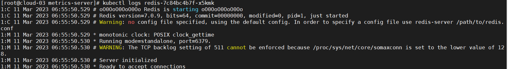
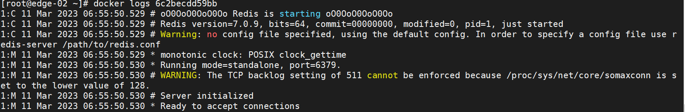

# metrics-demo

## Environment prepare

- KubeEdge、k8s 、node、cloud and so on

## Steps

1. Open `edgeStream` in edge

   ```sh
   vim /etc/kubeedge/config/edgecore.yaml
   ```

   ```yaml
     modules:
     ...
        edgeStream:
          enable: true
          handshakeTimeout: 30
          readDeadline: 15
          server: 124.222.110.11:10004
          tlsTunnelCAFile: /etc/kubeedge/ca/rootCA.crt
          tlsTunnelCertFile: /etc/kubeedge/certs/server.crt
          tlsTunnelPrivateKeyFile: /etc/kubeedge/certs/server.key
          writeDeadline: 15
      ....
   ```


2. Restart EdgeCore

   ```sh
   systemctl restart edgecore.service
   ```

3. Download `metrics-server` yaml, you should care about `Metrics Server Version` and ` Kubernetes version`, more in [metrics-server](https://github.com/kubernetes-sigs/metrics-server#compatibility-matrix)
   ```sh
   wget https://github.com/kubernetes-sigs/metrics-server/releases/latest/download/components.yaml
   ```

4. Add  ` hostNetwork: true` in yaml and `  - --kubelet-insecure-tls`

   ```yaml
     template:
       metadata:
         labels:
           k8s-app: metrics-server
       spec:
         hostNetwork: true
         containers:
         - args:
           - --cert-dir=/tmp
           - --secure-port=4443
           - --kubelet-preferred-address-types=InternalIP,ExternalIP,Hostname
           - --kubelet-use-node-status-port
           - --metric-resolution=15s
           - --kubelet-insecure-tls
           image: k8s.gcr.io/metrics-server/metrics-server:v0.6.2
   ```

5. Apply for metrics-server when you can normal download from  `k8s.gcr.io`

   ```sh
   kubectl apply -f components.yaml
   ```

   When you can't access normally `k8s.gcr.io`,you can try this way：

   ```sh
   # find the image 
   cat components.yaml
   
   # Pull from dockerproxy
   docker pull k8s.dockerproxy.com/metrics-server/metrics-server:v0.6.2
   
   # use docker tag
   docker tag k8s.dockerproxy.com/metrics-server/metrics-server:v0.6.2 k8s.gcr.io/metrics-server/metrics-server:v0.6.2
   
   # apply for yaml
   kubectl apply -f components.yaml
   ```

   ## Test

   It is tested by redis.

   1. Edit the  `redis.yaml`, you should care `spec/nodeName` to use your nodeName

      ```sh
      vim redis.yaml
      ```

   2. Apply for `redis.yaml`

      ```sh
      kubectl apply redis.yaml
      ```

   3. Now,you can view logs from edge

      ```sh
      # find redid pod 
      kubectl get po -A
      
      # view logs in cloud
      kubectl logs redis-7c84bc4b7f-x5kmk
      
      # view log in edge to validate
      docker logs k8s_redis_redis-7c84bc4b7f-znjs4_default_3ce4f96b-f8a8-4d1f-a983-b8165b65522f_0
      ```


You will get results just like this

Cloud logs：



Edge logs：


