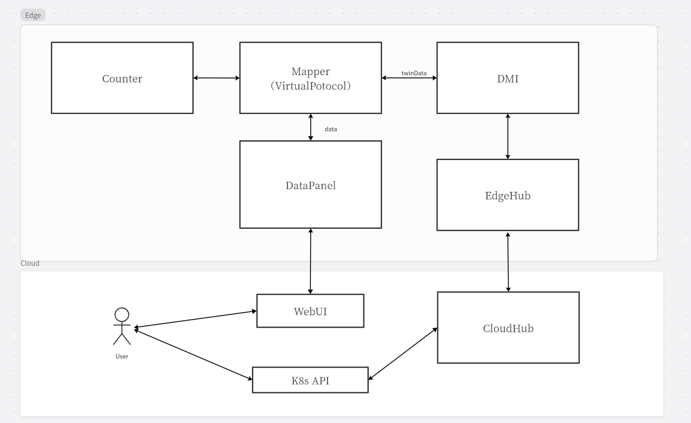
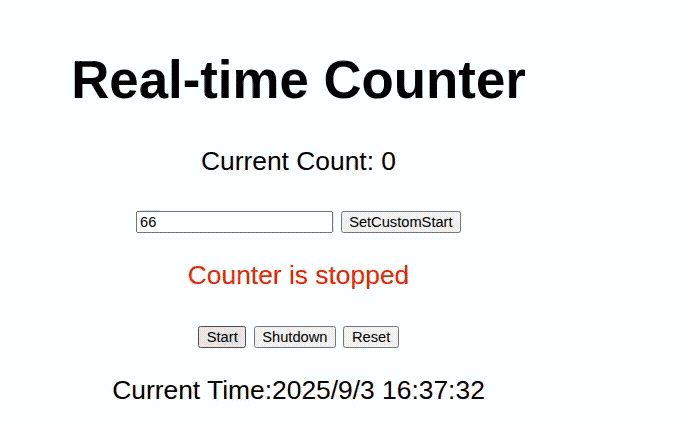

# New Counter Demo

## Description
Counter is a virtual device that uses VirtualProtocol, so users can run the demo without an additional physical device.

## Feature
- Status Control: Supports Start/Pause/Shutdown operations
- Customizable Start Value: Enter a number to set the initial counter value
- Real-time Update: Counter status and value automatically refresh every second
- Visual Feedback: Different statuses (Running/Paused/Stopped) are displayed in different colors

## Structure


## Prerequisites
- Docker
- KubeEdge v1.21+

## Quick Start
### Clone the repository and enter the demo directory
```
git clone https://github.com/kubeedge/examples.git
cd examples/new-counter-demo
```

### Mapper ✅(At the edge)
1. Build the mapper image
```
make build-mapper
```
2. Deploy the mapper
```
make deploy-mapper
```


### WebUI ✅(At the cloud)
1. Build the webUI image
```
make build-webUI
```
2. Deploy the webUI
```
make deploy-webUI
```
3. Open the Web Browser and go to the URL
```
http://127.0.0.1:8080
```

### Clean the resouces 
```
make clean
```
## Test



