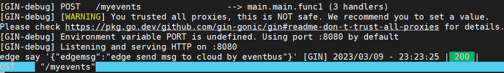
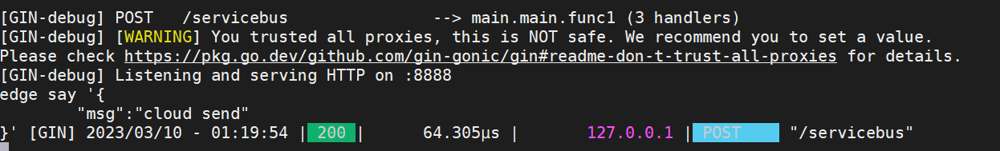

# Kubeedge-Rule

## Environment prepare

- KubeEdge、k8s 、node、cloud and so on 
- In cloud and edge，you should prepare for go version = 1.17 and open Go Modules maybe also goproxy 
- In edge，you should open `servicebus` and `eventbus`,check with `/etc/kubeedge/config/edgecore.yaml`

## eventbus->rest

1. prepare for ruleendpoint

   ```sh
   kubectl apply -f ruleEndpoint-eventbus.yaml
   kubectl apply -f ruleEndpoint-rest.yaml
   ```
   
2. prepare for rule
	- You should change yaml of `node_name` and targetResource of `resource`.`node_name` is your edge name,`resource` please  use your cloud ip.
	
	  ```sh
	  vi  rule-eventbus-to-rest.yaml	
	  ```
	- apply for rule yaml
	
	  ```sh
	  kubectl apply -f rule-eventbus-to-rest.yaml
	  ```

3. prepare  for app,copy `web_for_eventbus_to_rest_rule` for cloud

   ```sh
   cd web_for_eventbus_to_rest_rule
   go mod tidy 
   go run main.go	
   ```

4. send msg with mosquitto

   ```sh
   mosquitto_pub -t 'default/test' -d -m '{"edgemsg":"edge send msg to cloud by eventbus"}'
   ```

5. Now, you can get message in cloud , just like this
   

## rest->servicebus

1. prepare for ruleendpoint

   ```sh
   kubectl apply -f ruleEndpoint-rest.yaml
   kubectl apply -f ruleEndpoint-servicebus.yaml
   ```

2. prepare for rule

   ```sh
   kubectl apply -f rule-rest-to-servicebus.yaml
   ```

3. prepare  app in egde. copy `web_for_rest_to_servicebus_servicebus` to edge

   ```sh
   cd web_for_rest_to_servicebus_servicebus
   go mod tidy
   go run main.go
   ```

4. In cloud, send message to test , you should change `edge-02` which should be your node_name

   ```sh
   curl -H "Content-type: application/json" -X POST -d '{"msg":"cloud send"}' http://127.0.0.1:9443/edge-02/default/rest
   ```

5. Now , you can get message in edge , just like this
   

   
