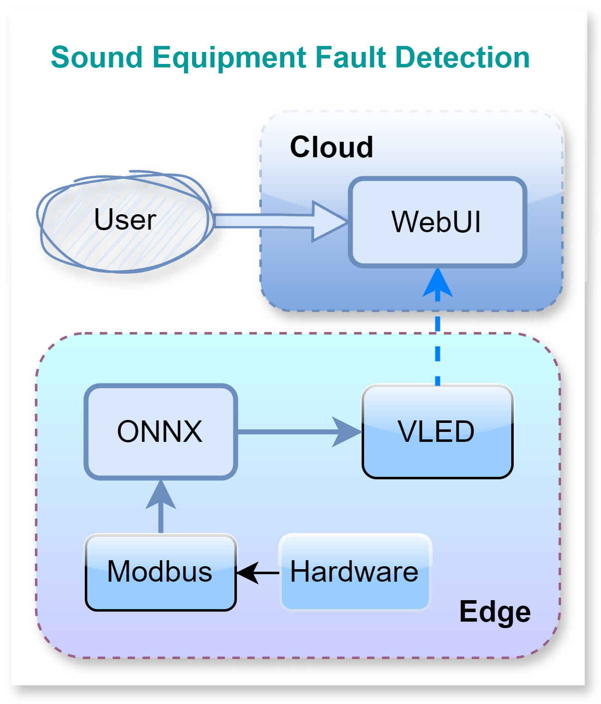
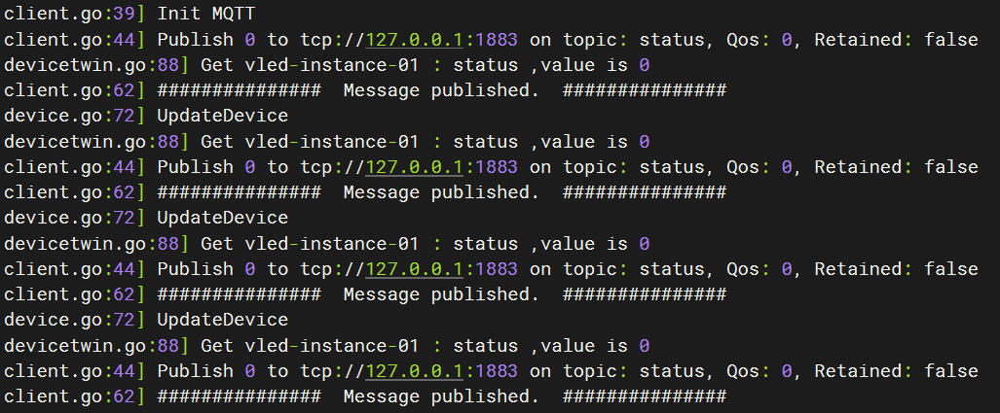
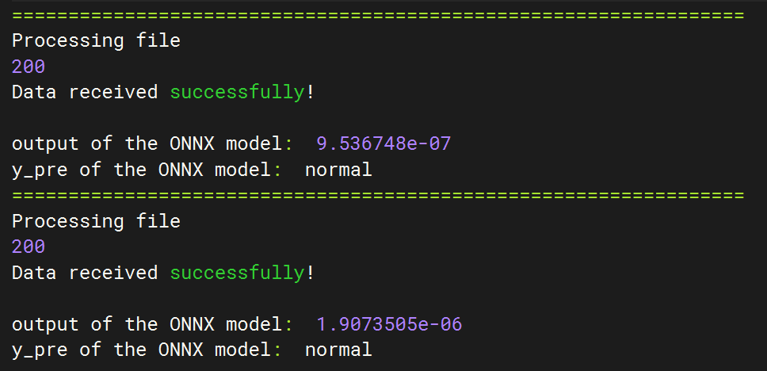
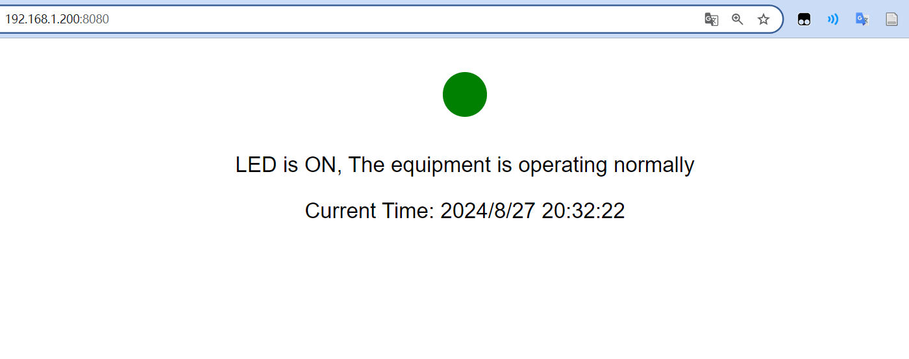

# Sound Equipment Fault Detection

## Description

The cloud is responsible for developing and training the audio fault detection model based on PyTorch, controlling the edge devices, and sending the fault detection model application to the edge nodes. The edge performs model reasoning based on the ONNX runtime.



## Prerequisites

* Ubuntu 22.04.4 LTS

* KubeEdge v1.7+

* MQTT Broker is running on Ubuntu.

## Steps to run the demo

### [1 Deploy hardware](hardware/README.md) ✅

Use pymodbus to create a Modbus protocol based server that simulates an audio device and allows clients to communicate and read data.

- Created a Modbus TCP server using the pymodbus library
- Provided the ability to read audio data chunks to the client via the Modbus protocol
- Supported the processing of multiple audio files simultaneously, each file was processed in chunks and provided to the client
- Used two threads: one thread handled the Modbus server and the other thread handled data updates

### [2 Deploy modbus](modbus/README.md) ✅

Use Go language to receive audio data through Modbus protocol and save it as a WAV file, which will be read and written by the onnx model for fault detection.

- Implemented a Modbus TCP client to receive chunked audio data from a Modbus server
- Each chunk of data consists of multiple registers, and the client reads chunk by chunk and combines them into a complete audio file
- After reading, save the audio data as a WAV file

### [3 Deploy vled](vled/README.md) ✅

Simulate an LED, implement the corresponding crd and connect to kubeedge



### [4 Deploy onnx](onnx/README.md) ✅

The ONNX audio anomaly detection model reads the wav audio file in a specific directory, and converts the detection result into the LED status and reports it to kubeedge.



### [5 Deploy webui](webui/README.md) ✅

The webui runs in the cloud and displays the audio fault detection results in real time. It reads the status of vled through the k8s api. The opening of vled indicates whether the machine is normal, which is then displayed on the web page.



### 6 Switch Sound Wave

- Execute the following command and observe the webui. The indicator light is off.
    ```shell
    # Detect abnormal sound waves
    kubectl patch configmap hardware-config -p '{"data":{"normal":"false"}}'
    kubectl delete -f hardware/resource/deployment.yaml --grace-period=0 --force
    kubectl delete -f modbus/resource/deployment.yaml --grace-period=0 --force
    # Ensure complete stop, port release
    kubectl apply -f hardware/resource/deployment.yaml
    kubectl apply -f modbus/resource/deployment.yaml
    ```

- Execute the following command and observe the webui, and you will find that the indicator is on
    ```shell
    # Detect normal sound waves
    kubectl patch configmap hardware-config -p '{"data":{"normal":"true"}}'
    kubectl delete -f hardware/resource/deployment.yaml --grace-period=0 --force
    kubectl delete -f modbus/resource/deployment.yaml --grace-period=0 --force
    # Ensure complete stop, port release
    kubectl apply -f hardware/resource/deployment.yaml
    kubectl apply -f modbus/resource/deployment.yaml
    ```