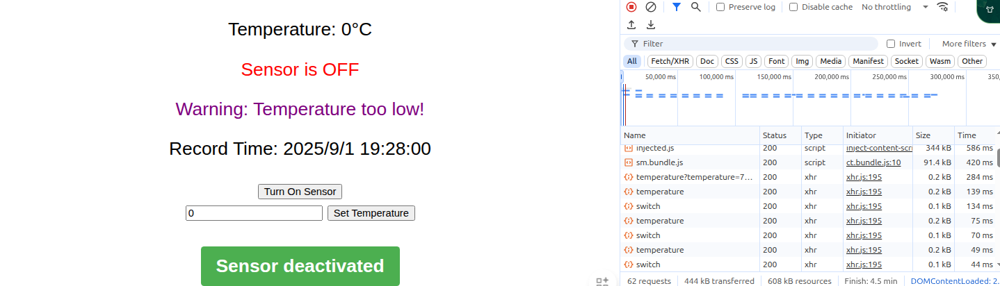

# Temperature Sensor 

## Description
This project is used to demonstrate a specific instance of kubeedge. It provides a cloud-edge collaboration example of a temperature sensor.

## Structure


## Prerequisites
* Docker
* KubeEdge v1.21.0+
## Quick Start
### 1. Clone the repository to local
```
git clone https://github.com/kubeedge/examples
cd ./examples/temperature-sensor-demo
```
### 2. Deploy components

#### [2.1 Deploy hardware](hardware/README.md) ✅(At the edge)

```
make build-hardware
make deploy-hardware
```
#### Other options
- Through Physical device

- [Install modbus Slave](https://www.modbustools.com/modbus_slave.html) (only for Windows users)
```
- Create TCP/RTU device connection, mapper uses TCP protocol by default.
- Configure Modbus registers:
- Temperature register: holding register, address 4000, data type: uint16
- Working status register: coil register, address 1001, data type: boolean
```
#### [2.2 Deploy modbus mapper](modbus/README.md) ✅(At the edge)
```
make build-modbus
make deploy-modbus
```
#### [2.3 Deploy webUI](webUI/README.md) ✅(At the cloud)
```
make build-webUI
make deploy-webUI
```
### 3. Test the demo
#### 3.1 View the synchronization of the reported field in the twins field:
```
kubectl get device -o yaml
```

#### 3.2 View the result through the webUI





